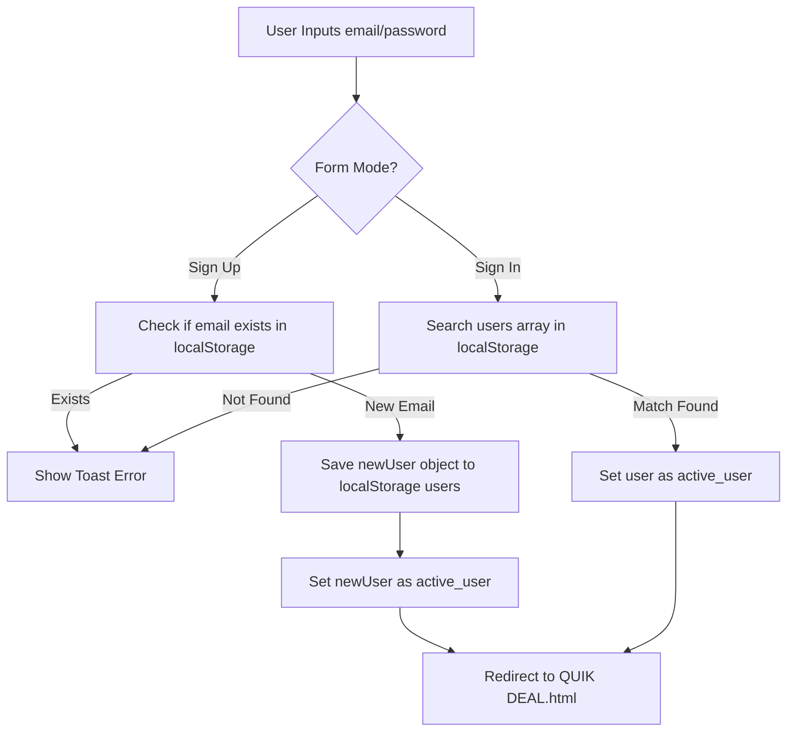

# QUICKDEAL - PREMIUM STATIC E-COMMERCE SUITE

QuickDeal is a premium, responsive multi-page static e-commerce website designed with rich aesthetics and client-side persistence. Re-engineered from legacy, baseline HTML components, the platform integrates clean CSS styling, interactive components, simulated cart states, user profile order tracking, and an animated progress overlay dialog for in-development items.

---

## 📋 Table of Contents
1. [Objectives & Project Scope](#-objectives--project-scope)
2. [Technology Stack](#-technology-stack)
3. [Repository Structure](#-repository-structure)
4. [System Architecture & Data Flows](#-system-architecture--data-flows)
5. [Page Directory & Re-Engineering Specifications](#-page-directory--re-engineering-specifications)
6. [Developer Environment & Setup Guide](#-developer-environment--setup-guide)
7. [User Guide](#-user-guide)
8. [Future Scope](#-future-scope)
9. [Conclusion](#-conclusion)

---

## 🎯 Objectives & Project Scope

### Objectives
- **Aesthetic Overhaul**: Replace legacy visual styles, marquee scrolls, and basic tables with professional layout tokens, Google Fonts typography, glassmorphism, responsive grids, and clean animations.
- **Client-Side Persistence**: Enable secure user signup and login sessions using HTML5 `localStorage` so users remain authenticated on return visits.
- **Cart & Order Lifecycle**: Maintain a live, responsive shopping cart with options to adjust item counts and checkout simulated orders.
- **Clean Restructuring**: Separate stylesheets, logic files, and graphical assets into an organized folders layout.

### Project Scope
| Scope Area | Covered in Current Implementation | Future Expansion |
| :--- | :--- | :--- |
| **Authentication** | Registration & Login via browser `localStorage` | JWT Server-side authentication, OAuth (Google) |
| **Cart Operations** | Live counter, add/remove items, quantity scaling | Promo code codes, active shipping address verification |
| **Order History** | Persisted history list, loyalty points, user stats | PDF Invoice generator, live tracking coordinates |
| **Development Interceptor**| In-progress modals for placeholder modules | Complete product dynamic catalog integrations |

---

## 💻 Technology Stack
- **Structure Layer**: HTML5 Semantic Markup (Descriptive headers, buttons, tables, and custom vector SVGs).
- **Styling Layer**: Vanilla CSS3 Custom Variables (Tokens for forest teal and champagne gold palette, transition parameters, flex/grid systems, and keyframe animations).
- **Behavior Layer**: Vanilla ES6 JavaScript (LocalStorage controllers, event interceptors, form validators, typewriter animation engines, and dynamic DOM injectors).
- **Graphics**: High-res study imagery (`assets/hero_banner.png`) and custom inline XML vector shapes.
- **Typography**: Google Fonts `"Outfit"` (clean text) & `"Playfair Display"` (luxury header serifs).

---

## 📁 Repository Structure
```directory
d:\Projects\QuickDeal\
│
├── QUIK DEAL.html              # Core Homepage (Carousel slider & Incredible Offers)
├── all categories.html        # Category collections directory (Men, Women, Kids Wear)
├── registration form.html      # Member login & registration portal (Card toggler)
├── about us.html               # Corporate story, values, and original cont1 helper card
├── my account.html             # Loyalty rewards profile panel & purchase ledger
├── contact us.html             # Customer assistance contact sheet
├── cart.html                   # Active shopping bag & order checkout column
├── product-detail.html         # Dynamic query-parameter-based product preview card
├── README.md                   # Complete developer & user handbook
│
├── css/
│   └── styles.css              # Universal design token sheet
│
├── js/
│   └── main.js                 # LocalStorage and interaction script
│
└── assets/
    └── hero_banner.png         # Main hero fashion header visual
```

---

## 🔄 System Architecture & Data Flows

### 1. User Sign-Up & Sign-In Data Flow
Below is a flow diagram mapping how inputs are processed during registration and sign-in:



### 2. Live Cart & Order Lifecycle
```mermaid
graph TD
    A[Click Add to Shopping Bag] --> B[Push Item to localStorage quickdeal_cart]
    B --> C[Increment Navbar Cart Badge Indicator]
    C --> D[Navigate to cart.html]
    D --> E[Render cart list dynamically from localStorage]
    E --> F[Adjust Quantity / Remove Items]
    F --> G[Click Place Order]
    G --> H{User logged in?}
    H -- No -- > I[Show Sign In Toast & Redirect]
    H -- Yes --> J[Simulate Order ID & push to active_user orders array]
    J --> K[Clear quickdeal_cart in localStorage]
    K --> L[Redirect to my account.html Dashboard]
```

---

## 📄 Page Directory & Re-Engineering Specifications

The project maintains the precise page file naming structure requested by the original PDF while restructuring the layout blocks:

| Page Path | Re-Engineered Visual Specifications | Functionality & JS Events |
| :--- | :--- | :--- |
| `QUIK DEAL.html` | Rich champagne and forest green sticky navbar. Auto-marquee slider. | Infinite product scroller pause-on-hover. Cart badge updates. Links to dynamic details. |
| `all categories.html` | Custom wear grids. Links to Byltbasics/Hopscotch intercepted. | Intercepts third party links to trigger the glowing animated "Feature in Progress" overlay. |
| `registration form.html`| Center glassmorphism auth card overlaid on a blurred hero background. | Switches card state between Login/Signup. Validates required fields, password registers. |
| `about us.html` | Clean mission statement cards and the original grey `cont1` card box. | Intercepts YouTube redirect to show the "Feature in Progress" modal. |
| `my account.html` | Renders a profile overview sidebar and loyalty stats metrics grid. | Validates if user is logged in. Reads order arrays to list recent transactions. |
| `contact us.html` | Left-side validation contact form. Right-side help coordinates panel. | Form validation checking for valid email formats and telephone lengths. |
| `cart.html` | Live checkout layout. Items list table and checkout breakdown box. | Increments, decrements, and deletes item indexes. Initiates order creation. |
| `product-detail.html` | Dynamic previewer detailing pricing, ratings, sizes, colors. | Parses `?id=X` values to load mock data structures. Quantity count indicators. |

---

## 🛠️ Developer Environment & Setup Guide

Since QuickDeal is built as a static client-side web application, setup is fast and simple:

### Prerequisites
- Any modern web browser (Google Chrome, Microsoft Edge, Mozilla Firefox, or Safari).
- A text editor or IDE (Visual Studio Code, Sublime Text, or Notepad++).

### Setup Procedures
1. Clone or copy the files directly to a directory on your machine (e.g. `d:\Projects\QuickDeal\`).
2. Make sure the following files and folders structure is maintained:
   - Root HTML files must reside in the folder root to enable correct relative navigation.
   - The stylesheet is located in `css/styles.css`.
   - The main script is located in `js/main.js`.
   - The banner image is located in `assets/hero_banner.png`.

### Running Locally
To launch the site locally, choose either method below:
- **Direct Launch**: Double-click [QUIK DEAL.html](file:///d:/Projects/QuickDeal/QUIK%20DEAL.html) in your file explorer to open it directly in your browser.
- **Dev Server (Recommended)**: If you have Python or Node.js installed, serve the directory to enable smooth local path resolutions:
  - *Python*: Run `python -m http.server 8000` in the directory, and navigate to `http://localhost:8000/QUIK%20DEAL.html`.
  - *Live Server (VS Code)*: Right-click `QUIK DEAL.html` and select "Open with Live Server".

---

## 📖 User Guide

### Step 1: Browse Products & Inspect Details
- Open the site homepage. The products marquee slider autoplays horizontally; hover your cursor over it to pause the scroller.
- Click any product title or card in the slider or "Incredible Offers" grid. You will be redirected to the dynamic `product-detail.html` page showing pricing, review counts, colors, sizes, and description texts.

### Step 2: Add Items & Manage Shopping Bag
- Choose your preferred size/color on a product page, and click **Add to Shopping Bag**.
- Notice the gold cart badge count increment in the sticky header. Click the Cart icon to open [cart.html](file:///d:/Projects/QuickDeal/cart.html).
- Change item quantities using the **+** or **-** buttons to observe subtotal calculations updating instantly, or delete items using the Trash icon.

### Step 3: Register an Account & Check out
- Click **Sign In** in the navigation bar to register your account.
- Toggle between Sign Up and Sign In formats. Complete your details (e.g. First Name, Last Name, Email, Password, and Gender).
- Click **Sign Up**. Upon success, a confirmation toast notification will appear, and you will be redirected to the homepage. The navbar will display `"Hi, [Name]!"`.
- Return to your Cart and click **Place Order**. Your shopping bag will clear, and you will be redirected to [my account.html](file:///d:/Projects/QuickDeal/my%20account.html).
- Check your user dashboard. You will see your order history table populated, points updated, and voucher balances updated!

---

## 🔮 Future Scope
- **Backend API Integration**: Connect the client-side system to a cloud-based server-side API (e.g. Node.js Express / Python Django) with SQL databases (PostgreSQL/MySQL) for real-time inventories.
- **Secure Authentication**: Replace client-side local storage authorization keys with secure HTTPOnly cookie tokens and JWT (JSON Web Tokens).
- **Payment Gateway Integration**: Process actual payments securely using Stripe or PayPal SDK wrappers.
- **Analytics & Recommendations**: Suggest personalized clothing recommendations on product detail templates using historical user purchase actions.

---

## 🏁 Conclusion
QuickDeal delivers a rich, highly polished, and responsive static e-commerce mockup. By using Vanilla CSS custom layout grids and ES6 JavaScript event streams, the site replaces baseline HTML patterns with modern glassmorphism features and dynamic cart actions. The client-side database layer built on `localStorage` simulates complex signup validations, profile orders summaries, and checkout flows, providing a solid blueprint for developer scaling or production transitions.
